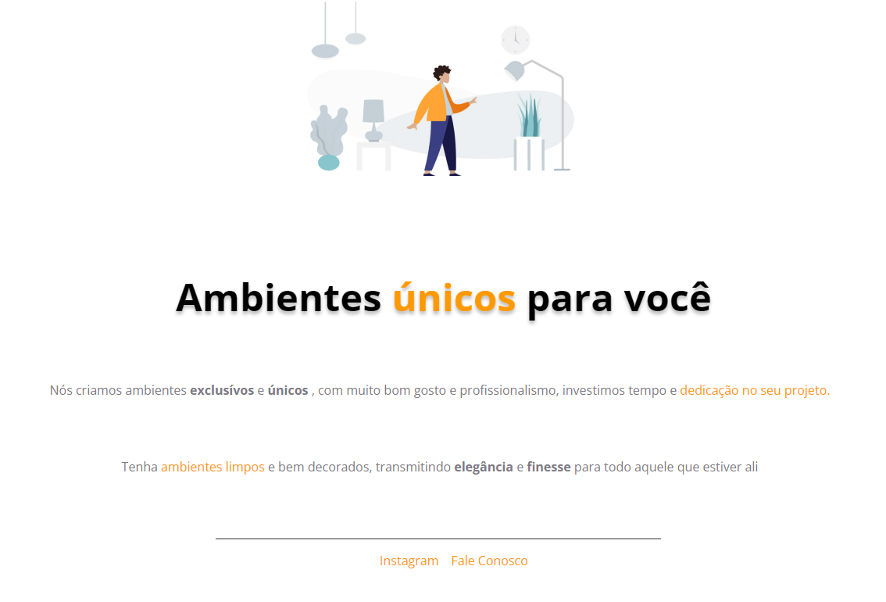

<h1 align="center"> Ambientes Únicos para você </h1>

## 🚀 Tecnologias

Esse projeto foi desenvolvido com as seguintes tecnologias:

- HTML e CSS
- Figma

## 💻 Projeto

Estudo de centralização, disposição de caixas, link, aplicação de estilos no todo e em partes específicas do texto.

- [Acesse o projeto finalizado, online](https://ifreitasmendes.github.io/Exp---Projeto-1/)

## 🔖 Layout

Você pode visualizar o layout do projeto através [DESSE LINK](https://www.figma.com/file/MiVlgYlztLoSpFL9O5X5KN/Explorer-Projeto-01-Copy?fuid=1103475932712843981). É necessário ter conta no [Figma](https://figma.com) para acessá-lo.

 

  

